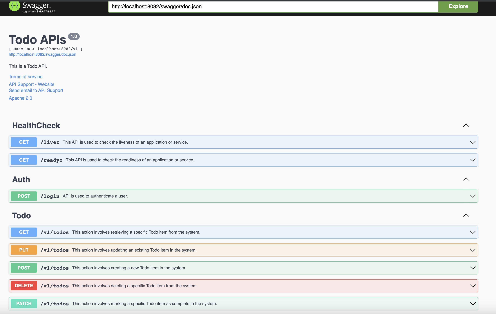

## todo-service

The "todo-service" is a Golang-based service that provides a set of APIs for managing TODO lists.
With this service, users can create, update, delete, and retrieve TODO items.
The service is designed to be scalable and can be easily deployed using Docker.

### Benefits
- Easy-to-use APIs for managing TODO lists
- Scalable service design
- Docker support for easy deployment

### Running the Service
#### Prerequisites
Before running the "todo-service", you'll need to have the following software installed:
- Golang (version 1.16 or higher)
- Docker (version 19.03 or higher)
- MySQL  (version 8.x or higher)

#### Running Locally
###### Prerequisites
- Start MySQL
````shell
   cd todo-service
   docker-compose up
   ````
###### Start Locally
1. Clone the repository:
    ```shell
   git clone https://github.com/yotzapon/todo-service.git
   ```
2. Start the service
   ```shell
   cd todo-service
   make run_local
   ````
3. Call readiness API to check the service status.
   ````shell
       curl -v http://localhost:8082/readyz | grep "OK"
   ````
#### Running with Docker
1. Clone the repository:
    ```shell
   git clone https://github.com/yotzapon/todo-service.git
   ```
2. Navigate to the project directory:
   ```shell
   cd todo-service/tests/automated
   ```
3. Run end-to-end test when finish the service will running
    ```shell
   sh ./run.sh
   ```
The service will start running, check on http://localhost:8082/readyz.

### API Endpoints
The following API endpoints are available in the "todo-service":

- GET /todos - Get all TODO items
- POST /todos - Create a new TODO item
- GET /todos?ids={id},{id} - Get a TODO item by IDs
- PUT /todos?id={id} - Update a TODO item by ID
- PATCH /todos?id={id} - Patch a TODO item to complete by ID
- DELETE /todos?id={id} - Delete a TODO item by ID
Please refer to the API documentation for detailed information on how to use these endpoints.

### API Documentation
#### Swagger-UI
The API documentation for the "todo-service" can be found at:
- http://localhost:8082/swagger/index.html

Screenshot


#### Postman Collection
In order to call APIs user import Postman collection at location:
```shell
    ./todo-service/docs/TodoApp.postman_collection.json
